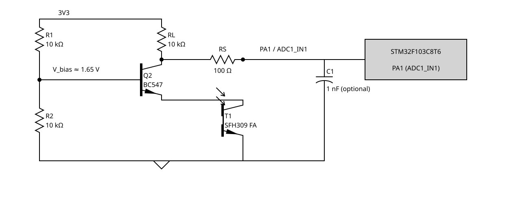

# shuttercheck

A camera shutter tester. An SFH 309 FA phototransistor senses light through the shutter.
A Black Pill board measures the exposure and sends it over USB serial.
The design needs no external comparator or trimpot.

[](https://github.com/etrommer/shuttercheck/actions/workflows/ci.yml)

## At a glance

- **Measurement range:** 1/4000 s to 6 s.
- **Output:** one `<exposure ns> ok` line for an accepted capture. Rejections print `0 <status>`.
- **Connection:** USB CDC serial. No host software is needed beyond a serial terminal.
- **Front end:** SFH 309 FA phototransistor and BC547 cascode circuit.

## What you need

| Item | Notes |
|---|---|
| Black Pill with [STM32F103C8T6](https://www.st.com/en/microcontrollers-microprocessors/stm32f103c8.html) | The default build targets the 64 KiB part. See [troubleshooting](docs/TROUBLESHOOTING.md) for 128 KiB clones. |
| [SFH 309 FA phototransistor](https://look.ams-osram.com/m/48f3c58ae57c5dfc/original/SFH-309.pdf) and BC547 NPN | Build the cascode stage in the wiring diagram. |
| R1, R2, and RL: 10 kΩ each; 100 Ω series resistor | A 1 nF capacitor is optional. |
| [ST-Link/V2](https://www.st.com/en/development-tools/st-link-v2.html) or another STM32 SWD probe | Used to flash the board. |
| USB cable | Connects the board to the computer and powers the circuit. |

## Wiring

Power the circuit from the board's **3V3** and GND pins. Never connect 5 V to PA1. Keep PA1 below 3.3 V + 0.3 V.



R1 and R2 form an equal divider. Use 10 kΩ for each. This sets the BC547 base near 1.65 V.
RL is 10 kΩ. Connect the cascode output to PA1 through the 100 Ω resistor.
The BC547 keeps the phototransistor collector voltage nearly constant. This improves response speed.
The optional 1 nF capacitor connects PA1 to GND. Keep the leads short.

## Build and use

Install [PlatformIO](https://platformio.org/) with `pipx install platformio` or the VS Code extension.
Connect the ST-Link to SWD: 3V3, GND, PA13/SWDIO, and PA14/SWCLK.

```sh
git clone https://github.com/etrommer/shuttercheck.git
cd shuttercheck
pio run
pio run -t upload
pio device monitor
```

Point the sensor lens through the shutter. Use a steady light source for an initial check.
The lens half-angle is about ±12°.
The monitor prints a boot header and one line for each capture.
If you open it after boot, press reset to see the header.

Example output:

```text
shuttercheck exposure
2481234 ok
0 stale
0 clipped
0 weak
```

The measurement is in nanoseconds. `2481234 ns` is about 2.48 ms, or 1/403 s.
The PB12 LED flashes once for an accepted capture. It stays dark for a rejection.

| Status | Meaning |
|---|---|
| `ok` | One opening and one closing crossing formed a valid measurement. |
| `stale` | A crossing had no matching edge from the same pulse. |
| `clipped` | The dark-side ADC level was too close to full scale. |
| `weak` | The light-to-dark signal change was too small to measure reliably. |

See [Troubleshooting](docs/TROUBLESHOOTING.md) if the board prints a rejection or the serial port does not work.

## Accuracy and limits

With a repeatable setup, expect about 0.1% class accuracy from 1/30 s to 1/2 s.
Expect a few percent at 1/4000 s, where shutter geometry dominates.
Faster exposures may resolve, but they are outside the accuracy budget.
Changing light levels can bias readings. Use the same light source when comparing cameras.

The sensor measures exposure at one point in the frame. It does not measure curtain travel across the frame, flash-sync timing, lens aperture, or absolute exposure.

## More information

- [Troubleshooting](docs/TROUBLESHOOTING.md): sensor readings, USB serial, uploads, and board differences.
- [Developer reference](docs/DEVELOPER.md): capture path, scan algorithm, accuracy model, and debug reports.
- [Testing](docs/TESTING.md): native scan tests and the on-device self test.
